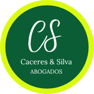

cysestudiojuridico.ar

<!DOCTYPE html>
<html lang="es-AR">
<head>
  <meta charset="UTF-8" />
  <meta name="viewport" content="width=device-width, initial-scale=1.0" />
  <title>CyS Estudio Jurídico | Cáceres & Silva Abogados</title>
  <meta name="description" content="CyS Estudio Jurídico. Dr. Juan Cáceres y Dra. Araceli Silva. Familia, sucesiones, jubilaciones, derecho laboral, accidentes de trabajo, societario, marcas y payroll. Atención virtual y presencial con cita previa en Berazategui, Quilmes, PBA y CABA." />
  <meta name="theme-color" content="#0b4f2f" />
  <meta property="og:title" content="CyS Estudio Jurídico" />
  <meta property="og:description" content="Asesoramiento legal claro, cercano y responsable. Atención virtual y presencial con cita previa." />
  <meta property="og:type" content="website" />
  <meta property="og:url" content="https://cysestudiojuridico.ar" />
  <link rel="icon" href="assets/logo-cys.png" />
  <link rel="preconnect" href="https://fonts.googleapis.com">
  <link rel="preconnect" href="https://fonts.gstatic.com" crossorigin>
  <link href="https://fonts.googleapis.com/css2?family=Inter:wght@400;500;600;700;800&family=Libre+Baskerville:wght@400;700&display=swap" rel="stylesheet">
  <link rel="stylesheet" href="styles.css" />
</head>
<body>
  <header class="header" id="top">
    <nav class="nav wrap">
      <a href="#top" class="brand" aria-label="CyS Estudio Jurídico">
        
        <strong>CyS</strong><small>Estudio Jurídico</small>
      </a>
      <button class="menu" aria-label="Abrir menú" aria-expanded="false">☰</button>
      

        <a href="#servicios">Servicios</a>
        <a href="#nosotros">Nosotros</a>
        <a href="#metodo">Cómo trabajamos</a>
        <a href="#faq">Preguntas</a>
        <a class="pill" href="#contacto">Contacto</a>
      

    </nav>
  </header>

  <main>
    <section class="hero">
      

        

          
Cáceres & Silva Abogados

          <h1>Asesoramiento jurídico claro, cercano y responsable.</h1>
          
Acompañamos a personas, familias, trabajadores, empleadores, emprendedores y sociedades con una atención profesional, ordenada y personalizada.

          

            <a class="btn primary" href="https://wa.me/5491134005803?text=Hola%2C%20quiero%20hacer%20una%20consulta%20jur%C3%ADdica" target="_blank" rel="noopener">Consultar por WhatsApp</a>
            <a class="btn ghost" href="#servicios">Ver servicios</a>
          

          

            BerazateguiQuilmesPBACABAVirtual
          

        

        <aside class="hero-panel reveal" aria-label="Datos principales del estudio">
          
          <h2>Atención virtual y presencial con cita previa</h2>
          
Coordinamos consultas online y reuniones presenciales previamente pautadas.

          

            
<strong>WhatsApp</strong>11 3400-5803

            
<strong>Emails</strong>Juan Cáceres · Araceli Silva

            
<strong>Modalidad</strong>Seguimiento personalizado

          

        </aside>
      

    </section>

    <section class="strip">
      

        
<strong>Atención personalizada</strong>Comunicación clara en cada etapa.

        
<strong>Enfoque práctico</strong>Pasos concretos y documentación necesaria.

        
<strong>Mirada integral</strong>Soluciones preventivas, judiciales y extrajudiciales.

      

    </section>

    <section class="section" id="servicios">
      

        

          
Áreas de práctica

          <h2>Servicios legales para cada etapa.</h2>
          
Brindamos orientación y patrocinio con lenguaje claro, estrategia y seguimiento responsable.

        

        

          <article class="card reveal">01<h3>Familia y sucesiones</h3>
Divorcios, alimentos, cuidado personal, régimen de comunicación, acuerdos, adopciones, declaratorias de herederos e inscripciones.
</article>
          <article class="card reveal">02<h3>Jubilaciones y pensiones</h3>
Análisis de aportes, jubilaciones, moratorias, pensiones y planificación previsional.
</article>
          <article class="card reveal">03<h3>Derecho laboral</h3>
Reclamos laborales, acuerdos, asesoramiento a trabajadores y empleadores, telegramas e indemnizaciones.
</article>
          <article class="card reveal">04<h3>Accidentes de trabajo</h3>
Acompañamiento ante ART, comisiones médicas, incapacidades, acuerdos y reclamos judiciales.
</article>
          <article class="card reveal">05<h3>Societario y marcas</h3>
Constitución y regularización de sociedades, trámites registrales, actas, dictámenes, IGJ, DPPJ e INPI.
</article>
          <article class="card reveal">06<h3>Payroll</h3>
Liquidación de sueldos y jornales para empleadores, empresas, comercios y organizaciones.
</article>
        

      

    </section>

    <section class="section about" id="nosotros">
      

        

          
Nosotros

          <h2>Un estudio jurídico con trato directo.</h2>
          
En CyS Estudio Jurídico creemos que una buena defensa empieza con una explicación clara. Por eso priorizamos la escucha, el orden documental y una estrategia realista para cada caso.

        

        

          <article><h3>Dr. Juan Cáceres</h3>
Abogado. Atención y seguimiento de asuntos judiciales, registrales, societarios, previsionales y de familia.
<a href="mailto:ab.juancaceres@gmail.com">ab.juancaceres@gmail.com</a></article>
          <article><h3>Dra. Araceli Silva</h3>
Abogada. Asesoramiento jurídico integral y acompañamiento profesional en trámites y procesos.
<a href="mailto:dra.aracelisilva@gmail.com">dra.aracelisilva@gmail.com</a></article>
        

      

    </section>

    <section class="section method" id="metodo">
      

        

Cómo trabajamos
<h2>Un proceso simple para avanzar con seguridad.</h2>

        

          
<b>1</b><h3>Consulta inicial</h3>
Nos contás brevemente tu situación por WhatsApp o email.

          
<b>2</b><h3>Revisión documental</h3>
Indicamos qué documentación necesitamos y ordenamos la información relevante.

          
<b>3</b><h3>Plan de acción</h3>
Te explicamos pasos posibles, tiempos estimados, costos y estrategia.

          
<b>4</b><h3>Seguimiento</h3>
Acompañamos el trámite o proceso con comunicación clara y responsable.

        

      

    </section>

    <section class="section faq" id="faq">
      

        

Preguntas frecuentes
<h2>Antes de consultar.</h2>
Estas respuestas son orientativas. Cada caso requiere análisis particular.

        

          

¿Atienden consultas virtuales?

Sí. Podemos coordinar consultas por videollamada o WhatsApp, y también reuniones presenciales con cita previa.

          

¿Qué documentación necesito para consultar?

Depende del tema. En general conviene tener DNI, constancias, recibos, cartas documento, partidas, expedientes o cualquier comprobante relacionado.

          

¿Trabajan en Provincia de Buenos Aires y CABA?

Sí. Atendemos asuntos en Berazategui, Quilmes, Provincia de Buenos Aires y Capital Federal, según la materia y jurisdicción.

          

¿Puedo consultar por una empresa o emprendimiento?

Sí. Brindamos asesoramiento societario, registral, marcas y servicios de liquidación de sueldos y jornales.

        

      

    </section>

    <section class="section contact" id="contacto">
      

        

          
Contacto

          <h2>Coordiná una consulta con el estudio.</h2>
          
Contanos tu situación y te indicaremos los próximos pasos.

        

        

          <a class="btn primary" href="https://wa.me/5491134005803?text=Hola%2C%20quiero%20hacer%20una%20consulta%20jur%C3%ADdica" target="_blank" rel="noopener">WhatsApp: 11 3400-5803</a>
          <a class="btn light" href="mailto:ab.juancaceres@gmail.com">Email Dr. Juan Cáceres</a>
          <a class="btn light" href="mailto:dra.aracelisilva@gmail.com">Email Dra. Araceli Silva</a>
        

      

    </section>
  </main>

  <footer class="footer">
    

      
<strong>CyS Estudio Jurídico</strong>Cáceres & Silva Abogados

      
Berazategui · Quilmes · PBA · CABAAtención virtual y presencial con cita previa

      <a href="#top">Volver arriba ↑</a>
    

  </footer>

  <a class="wa" href="https://wa.me/5491134005803?text=Hola%2C%20quiero%20hacer%20una%20consulta%20jur%C3%ADdica" target="_blank" rel="noopener" aria-label="Consultar por WhatsApp">WhatsApp</a>

  
</body>
</html>

# CyS Estudio Jurídico

Sitio web institucional estático para GitHub Pages.

:root{
  --green:#07502f; --green2:#0c6a42; --lime:#cdf21a; --ink:#14211a; --muted:#647067; --paper:#fbfaf4; --card:#ffffff; --line:#e8e3d4; --gold:#c9a44d; --shadow:0 24px 70px rgba(8,42,26,.14);
}
*{box-sizing:border-box} html{scroll-behavior:smooth} body{margin:0;font-family:Inter,system-ui,-apple-system,Segoe UI,sans-serif;color:var(--ink);background:var(--paper);line-height:1.55} a{color:inherit;text-decoration:none} img{max-width:100%;display:block}.wrap{width:min(1140px,calc(100% - 40px));margin-inline:auto}.header{position:sticky;top:0;z-index:50;background:rgba(251,250,244,.86);backdrop-filter:blur(16px);border-bottom:1px solid rgba(232,227,212,.8)}.nav{height:78px;display:flex;align-items:center;justify-content:space-between}.brand{display:flex;align-items:center;gap:12px}.brand img{width:50px;height:50px;border-radius:50%;box-shadow:0 0 0 3px rgba(205,242,26,.6)}.brand span{display:grid;line-height:1.1}.brand small{color:var(--muted);font-size:.78rem}.navlinks{display:flex;align-items:center;gap:26px;font-weight:700;font-size:.95rem}.navlinks a{color:#26352c}.pill{padding:11px 18px;border-radius:999px;background:var(--green);color:#fff!important}.menu{display:none;border:0;background:var(--green);color:white;border-radius:10px;padding:10px 12px;font-size:1.2rem}.hero{position:relative;overflow:hidden;background:radial-gradient(circle at top right,rgba(205,242,26,.34),transparent 28%),linear-gradient(135deg,#fffdf5 0%,#f3f0e3 100%);padding:92px 0 70px}.hero:before{content:"";position:absolute;inset:auto -10% -55% -10%;height:70%;background:linear-gradient(135deg,var(--green),#052b1a);border-radius:50% 50% 0 0;opacity:.08}.hero-grid{display:grid;grid-template-columns:1.15fr .85fr;gap:56px;align-items:center}.kicker{text-transform:uppercase;letter-spacing:.16em;color:var(--green2);font-weight:800;font-size:.78rem;margin:0 0 12px}.hero h1,.section h2{font-family:"Libre Baskerville",serif;letter-spacing:-.04em;line-height:1.06}.hero h1{font-size:clamp(2.45rem,6vw,5.1rem);max-width:850px;margin:0 0 22px}.lead{font-size:1.22rem;color:#415044;max-width:710px;margin:0 0 32px}.actions{display:flex;gap:14px;flex-wrap:wrap}.btn{display:inline-flex;align-items:center;justify-content:center;gap:8px;border-radius:999px;padding:14px 22px;font-weight:800;border:1px solid transparent;transition:.2s ease}.btn:hover{transform:translateY(-2px)}.primary{background:var(--green);color:#fff;box-shadow:0 14px 30px rgba(7,80,47,.22)}.ghost{border-color:var(--green);color:var(--green);background:rgba(255,255,255,.54)}.light{background:#fff;color:var(--green);border-color:#d9e2d7}.trust-row{display:flex;gap:10px;flex-wrap:wrap;margin-top:30px}.trust-row span{font-weight:800;color:var(--green);background:#fff;border:1px solid var(--line);border-radius:999px;padding:8px 13px}.hero-panel{background:linear-gradient(180deg,#ffffff,#f8f6ed);border:1px solid var(--line);box-shadow:var(--shadow);border-radius:30px;padding:34px;position:relative}.hero-panel:before{content:"";position:absolute;inset:14px;border:1px solid rgba(201,164,77,.35);border-radius:22px;pointer-events:none}.hero-logo{width:144px;height:144px;border-radius:50%;margin:0 auto 22px}.hero-panel h2{font-family:"Libre Baskerville",serif;font-size:1.7rem;text-align:center;margin:0 0 10px}.hero-panel p{text-align:center;color:var(--muted);margin:0 0 24px}.panel-list{display:grid;gap:12px}.panel-list div{display:flex;justify-content:space-between;gap:16px;padding:14px 0;border-top:1px solid var(--line)}.panel-list span{color:var(--muted);text-align:right}.strip{background:var(--green);color:white}.strip-grid{display:grid;grid-template-columns:repeat(3,1fr);gap:1px}.strip-grid div{padding:24px 22px;background:rgba(255,255,255,.06)}.strip-grid strong,.strip-grid span{display:block}.strip-grid span{color:#dce9df;margin-top:4px}.section{padding:86px 0}.section-head{text-align:center;max-width:780px;margin:0 auto 42px}.section h2{font-size:clamp(2rem,4vw,3.35rem);margin:0 0 16px}.section-head p:last-child,.large,.faq-grid>div>p{color:var(--muted);font-size:1.08rem}.cards{display:grid;grid-template-columns:repeat(3,1fr);gap:18px}.card{background:var(--card);border:1px solid var(--line);border-radius:24px;padding:26px;box-shadow:0 18px 45px rgba(20,33,26,.06);transition:.22s ease}.card:hover{transform:translateY(-5px);box-shadow:var(--shadow)}.card span{display:inline-flex;width:42px;height:42px;border-radius:50%;align-items:center;justify-content:center;background:#eff6e9;color:var(--green);font-weight:900;margin-bottom:18px}.card h3{font-size:1.25rem;margin:0 0 10px}.card p{margin:0;color:var(--muted)}.about{background:#fffdf7}.about-grid,.faq-grid{display:grid;grid-template-columns:.85fr 1.15fr;gap:54px;align-items:start}.lawyer-cards{display:grid;gap:18px}.lawyer-cards article{background:linear-gradient(135deg,#0b4f2f,#08351f);color:white;border-radius:26px;padding:28px;box-shadow:var(--shadow)}.lawyer-cards article:nth-child(2){background:linear-gradient(135deg,#183427,#0b5d38)}.lawyer-cards h3{font-family:"Libre Baskerville",serif;font-size:1.55rem;margin:0 0 12px}.lawyer-cards p{color:#dce9df}.lawyer-cards a{color:var(--lime);font-weight:800}.method{background:linear-gradient(180deg,#f5f2e6,#fffdf7)}.steps{display:grid;grid-template-columns:repeat(4,1fr);gap:16px}.step{background:#fff;border:1px solid var(--line);border-radius:22px;padding:24px}.step b{display:inline-flex;width:38px;height:38px;background:var(--lime);color:var(--green);align-items:center;justify-content:center;border-radius:50%;margin-bottom:12px}.step h3{margin:0 0 10px}.step p{color:var(--muted);margin:0}.accordion{display:grid;gap:12px}.accordion details{background:#fff;border:1px solid var(--line);border-radius:18px;padding:18px 20px}.accordion summary{cursor:pointer;font-weight:900;color:var(--green)}.accordion p{color:var(--muted);margin:12px 0 0}.contact{padding-top:20px}.contact-card{display:grid;grid-template-columns:1fr .9fr;gap:34px;align-items:center;background:linear-gradient(135deg,var(--green),#092f1d);color:white;border-radius:34px;padding:44px;box-shadow:var(--shadow);position:relative;overflow:hidden}.contact-card:after{content:"";position:absolute;right:-80px;bottom:-90px;width:260px;height:260px;border-radius:50%;background:rgba(205,242,26,.15)}.contact-card .kicker{color:var(--lime)}.contact-card h2{margin-bottom:12px}.contact-card p{color:#e0ece4}.contact-actions{display:grid;gap:12px;position:relative;z-index:2}.footer{padding:34px 0;background:#061f13;color:white}.footer-grid{display:flex;justify-content:space-between;gap:24px;align-items:center}.footer span{display:block;color:#cfe1d5}.footer a{color:var(--lime);font-weight:800}.wa{position:fixed;right:20px;bottom:20px;z-index:60;background:#25d366;color:white;border-radius:999px;padding:14px 18px;font-weight:900;box-shadow:0 14px 34px rgba(37,211,102,.35)}.reveal{opacity:0;transform:translateY(18px);transition:.65s ease}.reveal.show{opacity:1;transform:none}@media (max-width:900px){.navlinks{display:none;position:absolute;left:20px;right:20px;top:82px;background:white;border:1px solid var(--line);border-radius:22px;padding:18px;box-shadow:var(--shadow);flex-direction:column;align-items:stretch}.navlinks.open{display:flex}.menu{display:block}.hero-grid,.about-grid,.faq-grid,.contact-card{grid-template-columns:1fr}.cards{grid-template-columns:repeat(2,1fr)}.steps,.strip-grid{grid-template-columns:1fr 1fr}.hero{padding-top:60px}.footer-grid{display:grid}}@media (max-width:620px){.wrap{width:min(100% - 26px,1140px)}.nav{height:70px}.brand img{width:44px;height:44px}.hero h1{font-size:2.35rem}.lead{font-size:1.03rem}.hero-panel,.contact-card{padding:26px;border-radius:24px}.cards,.steps,.strip-grid{grid-template-columns:1fr}.section{padding:62px 0}.actions .btn,.contact-actions .btn{width:100%}.panel-list div{display:block}.panel-list span{text-align:left;display:block;margin-top:3px}.wa{left:14px;right:14px;text-align:center}}
